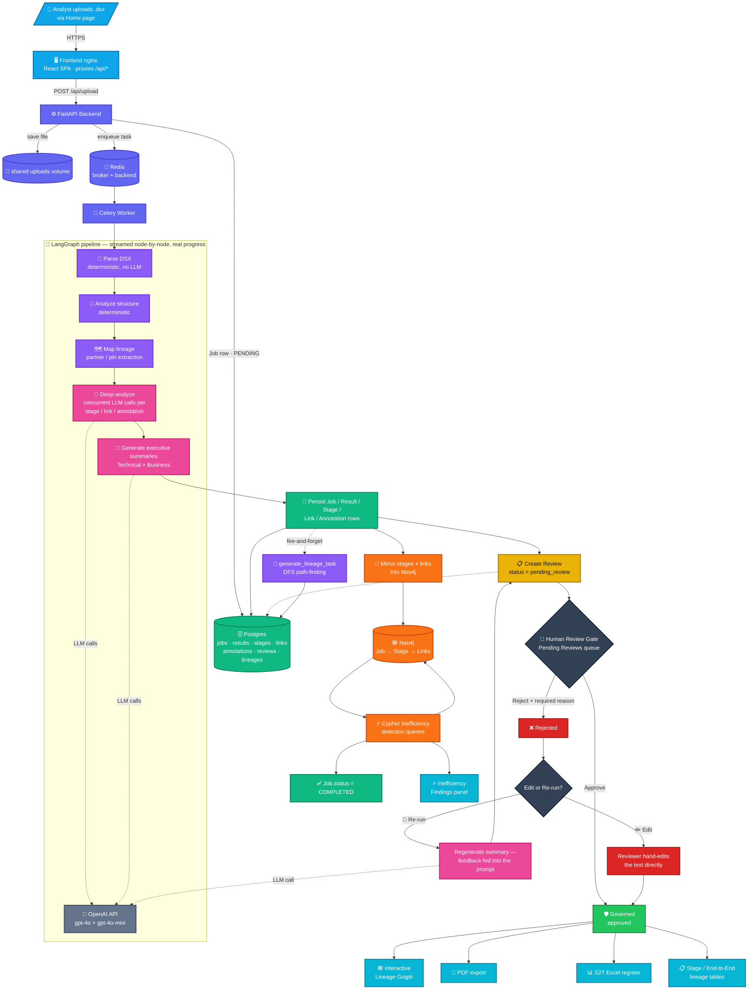
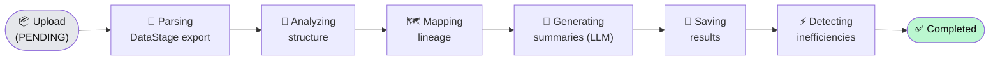

# DataWise

A web app for reverse-engineering IBM DataStage `.dsx` exports into governed, column-level data lineage. Users upload a job export; a LangGraph multi-agent pipeline parses it deterministically, extracts lineage, generates separate **technical** and **business** summaries via an LLM, mirrors the job into a **Neo4j** property graph to flag structural inefficiencies, and routes every AI-generated summary through a **human review/approval gate** before it's considered governed. Results are rendered as an interactive lineage graph, tabbed job dashboards, a cross-job review queue, and downloadable CSV/Excel/PDF artifacts.

Built by [ML arteka](https://ML arteka.ca).

---

## Architecture

End-to-end journey of a single file — upload, parse, LLM enrichment, persistence, graph mirroring, the human review gate (including reject → edit-or-rerun), and every downstream output:



**Job progress is real, not simulated.** `process_file()` streams the LangGraph pipeline (`stream_mode="updates"`) instead of a single blocking `invoke()`; the worker persists `Job.current_stage` after every node completes (`parsing → analyzing → mapping_lineage → generating_summaries → saving_results → detecting_inefficiencies → completed`). The Home page polls this and animates a live pipeline stepper.

**Human review gate.** Every completed job creates a `Review` row (`status="pending_review"`) for its executive summary. Nothing is "governed" until a named reviewer approves or rejects it — from either the job's own dashboard (status badge + link) or the dedicated **Pending Reviews** queue (`/reviews`), which is the primary triage surface across all jobs. Both hit the same `POST /api/reviews/{id}`.

**Neo4j is additive, not a hard dependency.** Postgres remains the system of record for the API and frontend contract (`GET /api/jobs/{id}/full` never changes shape). The worker mirrors stages/links into Neo4j and runs inefficiency detection there in a best-effort step — a Neo4j failure logs a warning and does not fail the job.

Uploads are written to a **shared filesystem** (Docker volume locally, Azure Files in Azure) so backend and worker both see the same `/app/uploads/` directory.

### Pipeline stages

The `Job.current_stage` values that drive the Home page's animated stepper — a simplified read of the same pipeline shown in full detail above:



---

## Frontend pages

| Route | Component | Purpose |
| --- | --- | --- |
| `/` | `Home.jsx` | Hero landing page, KPI tiles, "Start New Run" upload flow, animated pipeline stepper; auto-navigates to the job dashboard on completion |
| `/history` | `JobHistory.jsx` | Full list of processed jobs (status, upload time, delete) |
| `/jobs/:jobId` | `JobDetails.jsx` | Per-job tabbed dashboard — see below |
| `/reviews` | `PendingReviews.jsx` | Cross-job review queue — approve/reject with an inline summary preview |

**Job dashboard (`/jobs/:jobId`)** has a persistent header (Job Overview, including Review Status) and five tabs:

- **Summary** — technical and business summaries side by side, each with a copy-to-clipboard button
- **Inefficiency Findings** — Cypher-detected structural patterns (high fan-in/out, long derivation chains, orphan stages, repeated stage types), with severity badges
- **Lineage Graph** — interactive ReactFlow graph (click any node/link for its LLM explanation), with PDF and Excel (S2T register) export
- **Stage Lineage** — searchable, CSV-exportable stage-level table
- **End-to-End Lineage** — searchable, CSV-exportable source→target lineage table

A dark-mode toggle (persisted, `prefers-color-scheme`-aware) is available from the top nav on every page.

---

## Repo layout

```
.
├── src/
│   └── dsxlineage/               # FastAPI service (uv-managed Python package)
│       ├── agents/               # LangGraph agents (parser, analyzer, lineage, deep_analyzer,
│       │   │                     # inefficiency_agent) + workflow.py (graph definition, streaming)
│       │   └── lib/               # DSX parsing + partner/pin extraction (no LLM)
│       ├── api/endpoints.py      # REST routes mounted at /api
│       ├── core/config.py        # Pydantic settings (Postgres, Redis, Neo4j, OpenAI)
│       ├── db/                   # SQLAlchemy models, session, graph.py (Neo4j driver + sync)
│       ├── services/             # lineage_analyzer.py (DFS path-finding), s2t_export.py (Excel)
│       ├── worker.py             # Celery app + process_dsx_task + generate_lineage_task
│       └── main.py               # FastAPI entry
├── tests/                        # Parser/lineage verification scripts
├── scripts/                      # Ops/debug scripts (check_db.py, show_lineage.py, ...)
├── migrations/                   # Hand-written SQL migrations (run manually per env)
├── data/
│   ├── samples/                  # Sample .dsx + reference outputs
│   └── end_to_end_linage/        # Generated lineage CSVs for samples
├── frontend/                     # Vite + React (JSX)
│   ├── src/
│   │   ├── App.jsx                # Routes, top nav, dark-mode toggle
│   │   ├── main.jsx
│   │   └── components/
│   │       ├── Home.jsx           # Landing hero + animated run stepper + KPI tiles
│   │       ├── JobHistory.jsx     # Processed jobs list
│   │       ├── JobDetails.jsx     # Tabbed per-job dashboard + lineage graph
│   │       ├── PendingReviews.jsx # Cross-job review queue
│   │       └── FileUpload.jsx
│   ├── public/                   # favicons, logo (served at root)
│   ├── nginx.conf.template       # Runtime-templated reverse proxy
│   ├── vite.config.js            # Dev proxy for /api → backend
│   └── Dockerfile                # node build → nginx:alpine serve
├── terraform/                    # Azure IaC (see terraform/README.md)
├── docs/                         # Design notes, deploy patterns
├── Dockerfile                    # python:3.12-slim + uv (backend + worker image)
├── pyproject.toml / uv.lock      # uv-managed Python deps
├── docker-compose.yml            # Local dev stack (backend, worker, frontend, db, redis, neo4j)
└── .env.example                  # Required env vars
```

---

## Quickstart (local)

```bash
cp .env.example .env
# Edit .env and set a real OPENAI_API_KEY

docker-compose up --build
```

Then:

| Service        | URL                             |
| -------------- | -------------------------------- |
| Frontend UI    | http://localhost:5173            |
| Backend API    | http://localhost:8000            |
| API docs       | http://localhost:8000/docs       |
| Postgres       | `localhost:5433` (`postgres` / `postgres` / `dsx_db`) |
| Redis          | `localhost:6379`                 |
| Neo4j Browser  | http://localhost:7474 (`neo4j` / see `NEO4J_PASSWORD`) |
| Neo4j Bolt     | `localhost:7687`                 |

Watch logs in another tab:

```bash
docker-compose logs -f backend         # FastAPI
docker-compose logs -f celery_worker   # async processing + LLM calls + Neo4j sync
```

Upload a sample DSX via the UI ("Start New Run" on the home page) or via curl:

```bash
curl -F "file=@data/samples/BNCMRXALLInsSTGTransactionActual.dsx" \
  http://localhost:8000/api/upload
```

Tear down with `docker-compose down` (keeps DB/graph data) or `docker-compose down -v` (clean slate — required after pulling schema changes, since `Base.metadata.create_all` only adds new tables, not columns on existing ones; apply `migrations/*.sql` by hand against a non-disposable database).

---

## API surface

All routes are mounted at `/api`.

| Method   | Path                                  | Purpose                                              |
| -------- | -------------------------------------- | ----------------------------------------------------- |
| `POST`   | `/api/upload`                          | Upload a `.dsx`, returns `{job_id}`, kicks off the pipeline |
| `GET`    | `/api/jobs`                            | List jobs                                             |
| `GET`    | `/api/stats`                           | Dashboard KPIs — job counts, review coverage %, inefficiency count |
| `GET`    | `/api/jobs/{id}`                       | Job metadata, `status`, `current_stage`, counts       |
| `GET`    | `/api/jobs/{id}/full`                  | Job + stages + links + annotations (the graph contract) |
| `GET`    | `/api/results/{id}`                    | Technical + business summary, raw parse, analysis JSON |
| `GET`    | `/api/jobs/{id}/reviews`               | Review rows for one job                               |
| `GET`    | `/api/reviews`                         | Cross-job review queue (`?status=pending_review` default, or `all`) |
| `POST`   | `/api/reviews/{id}`                    | Approve/reject a review `{reviewer, decision, feedback}` |
| `GET`    | `/api/stages/{id}/explanation`         | LLM-generated stage explanation                       |
| `GET`    | `/api/links/{id}/explanation`          | LLM-generated link explanation                        |
| `GET`    | `/api/jobs/{id}/lineage`               | End-to-end lineage (Postgres-backed)                  |
| `GET`    | `/api/jobs/{id}/inefficiencies`        | Flagged structural inefficiency patterns (Neo4j-backed) |
| `GET`    | `/api/jobs/{id}/export/s2t`            | Source-to-target mapping register (`.xlsx` download)  |
| `GET`    | `/api/jobs/{id}/stage-lineage`         | Stage-level lineage (legacy CSV-backed, optional)     |
| `DELETE` | `/api/jobs/{id}`                       | Delete a job                                          |

Interactive OpenAPI / Swagger UI is at `/docs` (FastAPI).

---

## Configuration

All config flows through env vars. Sensitive values come from a `.env` file locally and from Azure Key Vault in Azure (see [`terraform/README.md`](terraform/README.md)).

| Variable | Required | Notes |
| --- | --- | --- |
| `OPENAI_API_KEY` | yes | Used by the deep-analyzer agent for technical + business summaries |
| `OPENAI_MODEL` | no (default `gpt-4o`) | Main model for stage analysis; link/annotation/summary calls use `gpt-4o-mini` |
| `DATABASE_URL` | no | If set, wins over `POSTGRES_*` components |
| `POSTGRES_USER` / `POSTGRES_PASSWORD` / `POSTGRES_SERVER` / `POSTGRES_PORT` / `POSTGRES_DB` | no | Default to docker-compose values |
| `CELERY_BROKER_URL` / `CELERY_RESULT_BACKEND` | no | Both default to local Redis; in Azure both point to Azure Cache (`rediss://…?ssl_cert_reqs=CERT_REQUIRED`) |
| `NEO4J_URI` | no (default `bolt://neo4j:7687`) | Self-hosted Neo4j Community — internal-only in Azure |
| `NEO4J_USER` / `NEO4J_PASSWORD` / `NEO4J_DATABASE` | no | Password is Terraform-generated and Key-Vault-sourced in Azure |
| `BACKEND_URL` | frontend prod | nginx in the frontend image substitutes this into its `/api/*` proxy_pass |
| `VITE_BACKEND_URL` | frontend dev | Vite dev-server proxy target for `npm run dev` |

---

## Deployment

The project deploys to **Azure Container Apps** with managed Postgres, managed Redis, self-hosted Neo4j, Key Vault, and Azure Files. Infrastructure is fully described in Terraform under `terraform/`.

See **[`terraform/README.md`](terraform/README.md)** for the end-to-end runbook (state bootstrap, first apply, image build/push, second apply, rollout patterns).

The compose services map to four Container Apps in a shared environment:

| Compose service | Container App                | Ingress                    |
| --------------- | ----------------------------- | --------------------------- |
| `backend`       | `ca-dsxlineage-dev-backend`   | public :8000                |
| `frontend`      | `ca-dsxlineage-dev-frontend`  | public :80                  |
| `celery_worker` | `ca-dsxlineage-dev-worker`    | none                        |
| `neo4j`         | `ca-dsxlineage-dev-neo4j`     | internal only, TCP :7687    |

Postgres and Redis are managed Azure PaaS (Flexible Server / Cache for Redis), not containers — Neo4j has no equivalent managed offering, so it runs self-hosted as a fourth Container App with an Azure Files-backed volume for `/data` and a Terraform-generated password sourced from Key Vault.

---

## Tech Stack

**Backend:** Python 3.12, FastAPI, Uvicorn, SQLAlchemy, Pydantic v2, Celery, LangGraph (streamed execution), LangChain, OpenAI SDK, Neo4j Python driver, openpyxl, uv
**Frontend:** React 18, Vite, Tailwind CSS (dark mode), axios, React Router, ReactFlow, dagre, react-markdown, jsPDF/html-to-image
**Data:** PostgreSQL (system of record), Neo4j Community (graph mirror + inefficiency detection), Redis (Celery broker), Azure Files (shared uploads)
**Cloud:** Azure Container Apps, Azure Container Registry, Azure Key Vault, Azure Database for PostgreSQL Flexible Server, Azure Cache for Redis, Azure Storage, Azure Log Analytics
**IaC:** Terraform (azurerm ~> 3.110)

---

## Project conventions

- **Date awareness** — never hardcode dates; derive from `date.today()` (Python) or inject `created_on=$(date -u +%F)` (Terraform CI).
- **Secrets** — never in source, `.tfvars`, or committed config. Local: `.env` (gitignored). Azure: Key Vault, referenced by Container App secret blocks with versionless URIs.
- **Image tags** — never `:latest`. Tags are timestamps (`$(date -u +%Y%m%d-%H%M%S)`); a fresh tag forces a new Container Apps revision so KV-sourced secrets are re-fetched.
- **Platform** — on Apple Silicon, always `docker build --platform linux/amd64` so images run in Azure (linux/amd64 only).
- **Schema changes** — `Base.metadata.create_all` only creates new tables; new columns need both a model change and a hand-written file in `migrations/` (applied manually per environment).

---

## Known dev compromises

These are acceptable for dev but **must be addressed before prod**:

- Postgres + Redis + Storage Account have `public_network_access_enabled = true`. Prod needs private endpoints with VNet integration.
- ACR uses admin credentials (tenant restriction blocked `AcrPull` role assignment). Prod should use a managed identity with `AcrPull` granted by an ops principal who can write role assignments.
- Key Vault `purge_protection_enabled = false` so dev teardown is clean. Prod must enable it.
- No Front Door / WAF in front of public ingress.
- Container Apps auto-scaling uses replica bounds only; no KEDA HTTP/queue triggers configured.
- CORS in backend is wide-open (`allow_origins=["*"]`); tighten before exposing publicly.
- Neo4j Community has no clustering/HA — single replica; acceptable for a demo, not for production lineage-of-record.
- Review-gate identity is a free-text reviewer name, not authenticated — fine for a demo, needs real auth/SSO before production use.

---

## License

Internal — ML arteka.
