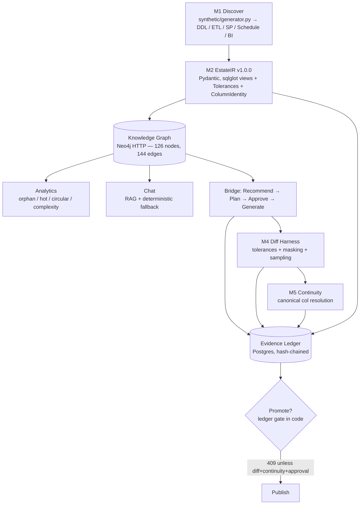

# Estate Modernization Accelerator

> **On-prem estate lineage, analytics, grounded chat, and migration bridge — knowledge graph + evidence ledger as system of record.**
>
> *Point at a legacy on-prem estate and prove the cloud move — column by column, lineage edge by lineage edge.*

[](https://www.python.org)
[](https://fastapi.tiangolo.com)
[](tests/)
[](#license)

Built by [ML arteka](https://mlarteka.ca) · Toronto, Canada · `2026-10-07` — Analytics reimagined `2026-10-08` · Multi-estate + live Todo `2026-10-08`

---

## Table of Contents

- [Why this exists](#why-this-exists)
- [What it does](#what-it-does)
- [Architecture](#architecture)
- [Tech Stack](#tech-stack)
- [Repo Layout](#repo-layout)
- [Quickstart](#quickstart)
- [API Surface](#api-surface)
- [Testing & Gates](#testing--gates)
- [Deployment](#deployment)
- [Project Conventions](#project-conventions)
- [License](#license)

---

## Why this exists

Cloud estates already have lineage for free — OpenLineage on Glue/EMR and Unity Catalog on Databricks capture it automatically. **On-prem estates do not.** A typical bank still runs:

```
SAP ECC + Salesforce + Flat Files
        │  600+ Informatica / DataStage mappings (nightly batches)
        ▼
  Oracle 11g Data Warehouse (Toronto DC)
  ├─ 1,400 tables · 800 views · 320 stored procedures
  ├─ 90 Control-M jobs · 40 Tableau / Cognos dashboards
  └─ 22 years of undocumented VIEW → SP → VIEW → JOB → DASHBOARD chains
```

Informatica PowerCenter 10.5 standard support ended **2026-03-31**, extended support ends **2027-03-31**. BCBS 239 still asks *“show me how this risk number came to be.”* DC renewals are 3×.

> **Manta describes. We migrate and prove.**

Existing tools do one slice well — Lakebridge converts (Databricks-locked, free), Datafold diffs (value-level but no lineage continuity), Manta parses (no conversion) — but *no product proves the new lineage reproduces the old and records who approved each difference*. That gap is the product.

---

## What it does

| Capability | What you get | Why it matters |
|---|---|---|
| **1. Lineage Graph** | End-to-end `Source → ETL → Table → View → SP → Job → Dashboard` with column-level edges. Dynamic SQL / `EXECUTE IMMEDIATE` flagged `UNRESOLVED` (amber) — never hidden. Click any node → blast-radius downstream. Layer swimlanes (Source / ETL / Warehouse / BI). | See the estate as it actually runs, not as slides say it does. |
| **2. Estate Analytics — Health → Priorities** | **Hero:** `Estate Health 76/100 — Moderate Risk` + `Readiness 62%` + `Orphan cost $12k/yr` + `p50/p90/max` blast. **Quadrant:** Risk vs Value scatter (top-right = prove last, top-left = delete, bottom-right = wedge). **Prioritized:** Quick Wins (13 orphans 10% → DROP), Wedge (Finance Mart 18 objects, 0 unresolved), Watchlist (5 unresolved + 1 circular). **Visuals:** hot-bars, orphan donut, depth histogram (d1 table-only / d2 view→table / d3 view→view→table), complexity. Dashboard criticality (`regulatory`/`revenue`/`ops`). | See the estate, know what to cut / move / fix first. |
| **3. Grounded Chat — Modern** | `TF-IDF retrieval (pgvector mock)` + deterministic fallback; `openai/gpt-4o` via OpenRouter when `OPENROUTER_API_KEY` set. Header `✦ Estate Chat — grounded · cites FQNs`, bubbles (user `indigo`, assistant `white` + `?`/`!` for refused/error), `…` typing, input `Ask me anything about the estate`. Every impact answer lists **all** downstream (e.g., `PROC_GENERATE_KEYS` → 26) with `… +21 more` expand. No citation pills — citations are in the prose. | Ask “What breaks if I drop `VW_RISK_EXPOSURE`?” → conversational, fully listed, cited. |
| **4. Bridge (Migrate with Proof)** | **Recommend** Snowflake wedge (18, days, risk) → **Plan** (named approver ≥2 chars + `actor_email` → `actor_id = uuid5(email)`) → **Generate** per-attribute Snowflake DDL (`VARCHAR2(100 CHAR)`→`VARCHAR(100)`, `NUMBER(*,0)`→`NUMBER(38,0)`, `NVL→COALESCE`) + per-FQN Terraform → **Diff** real DuckDB `EXCEPT` + `ABS(CAST(x AS DOUBLE)-CAST(y))<=epsilon` + `LOWER` + masked columns + `3/n` → **Continuity** `ColumnIdentity` + `difflib` alias (`customer_id↔cust_id` 0.92, ≥0.85) → **Promote** gated (`diff+continuity+approval` + `verify`). | Conversion that cannot be promoted without proof. Ledger is the audit trail. |

Synthetic POC estate under `data/synthetic_estate/` (`seed=42`, `Faker`+`sqlglot`) — **no production data needed**: 50 tables, 24 views, 18 SPs, 14 ETL (DataStage/SSIS/Informatica), 12 schedules, 8 dashboards, 147 lineage edges, 100-Q bench.

---

## Architecture

### Estate (new — system of record)



*   **EstateIR** (`src/dsxlineage/estate/ir.py`) is versioned Pydantic and the *only* place semantic mismatches (null/decimal/collation/timezone), dynamic SQL, and `ColumnIdentity` are modeled — per Brief §4.2.
*   **Ledger** (`LedgerEvent` now `actor_id = uuid5(email)`, `actor_email_hash`, `canonical_payload_hash` via `orjson` sorted, `prev_hash` chain, genesis `GENESIS`, `SELECT … FOR UPDATE` on Postgres) — `verify_ledger_chain` checks canonical; `can_promote` is the `409` gate on `POST /api/estates/{id}/bridge/promote`.
*   **Chat** is TF-IDF retrieval (`src/dsxlineage/estate/retrieval.py`, `sklearn`, 126 docs, `max_features=5000`, cosine ≥0.08) + deterministic fallback; LLM path (`openai/gpt-4o` via OpenRouter, `temperature=0`, `max_tokens=800`, `with_structured_output`, `date.today()` in prompt, PII never sent) is grounded and refused when ungrounded. `httpx==0.25.2` pinned for `TestClient` compat. UI is `features/estate/ChatPanel.jsx` — header `✦`, bubbles, `…` typing, no pill citations.
*   **Analytics** (`src/dsxlineage/estate/analytics.py`) now emits `estate_health` (76 Moderate Risk), `migration_readiness`, `orphan_cost_label`, `blast_stats{p50,p90,max}`, `lineage_depth{histogram}`, `quadrant[{fqn,value,risk}]` — hero + Risk vs Value scatter + 3 prioritized cards.
*   **Diff** is real DuckDB (`_duckdb_diff_table`: `read_csv` → `EXCEPT` / anti-join `ABS(CAST… )<=epsilon` + `LOWER` + masked columns) with fast-path for `source==target` synthetic.
*   **Neo4j** stays HTTP (Browser-compatible, no bolt) and is best-effort — estate creation never fails on graph outage.

### Legacy ETL — archived at `archive/etl-v1` / tag `v1-etl-final` (estate-only since 2026-10-08)

Estate is now the product (`/api/estates`, `/estates`). The three parsers (`dsx` `BEGIN/END`, `dtsx`, `POWERMART`) live as a **pure library** at `src/dsxlineage/parsers/` (`from dsxlineage.parsers import parse_dsx`) and are reused by `estate/extractor.py`. The old DataWise ETL app (`POST /api/upload`, `/api/jobs`, `/history`, `/jobs/:id`, `ScopeIQ`, `OpenMetadata` push) is frozen at `v1-etl-final` — see `archive/etl-v1/`.

### Gates (evidence, not dates)

`1a` Views (sqlglot recall ≥0.95) · `1b` SPs (12 clean + 6 `UNRESOLVED` flagged) · `1c` Scheduler+BI · `B` Parity (`3/n` bound) · `C` Continuity (`ColumnIdentity` precision/recall). The promote endpoint enforces `B+C`.

---

## Tech Stack

| Layer | Choice |
|---|---|
| **Runtime** | Python 3.12, `uv` (never `pip`/`poetry`), `hatchling` |
| **API** | FastAPI 0.104, Uvicorn, Pydantic v2, `python-multipart` |
| **Data** | PostgreSQL (ledger + `pg` system of record), Neo4j 5 Community via HTTP Cypher, Redis 7 (Celery broker) |
| **AI** | LangGraph (streamed `on_stage`), LangChain + OpenAI SDK via OpenRouter (`OPENROUTER_MODEL=openai/gpt-4o`), `sqlglot` (Oracle view parsing), `Faker` (synthetic) |
| **Compute** | Celery 5.3 (worker still handles legacy ETL; estate path is synchronous for POC) |
| **Frontend** | Vite 5 + React 18 + React Router 6 + `@tanstack/react-query` (staleTime 30s) + axios central `lib/api.js` + `AuthContext` (mock `uuid5`) + ReactFlow 11 + `react-markdown` + Tailwind 3.3 PostCSS-purged (`tailwind.config.js`, `postcss.config.js`, `index.css` `@tailwind`) + `features/estate/*` split (was God component) |
| **Infra** | Docker + Caddy + supervisord (`Dockerfile.web`), Azure Container Apps, ACR, Key Vault, PG Flexible Server, Redis, Neo4j self-hosted (estate-only — `openmetadata_*` removed from `docker-compose.yml` + `terraform/`; ledger is the publish layer), remote Blob state |

---

## Repo Layout

```
.
├── src/dsxlineage/
│   ├── estate/                 # accelerator core (NEW)
│   │   ├── ir.py               # EstateIR v1.0.0 — ColumnDef/TableDef/ViewDef/ProcedureDef/Edge/Tolerances
│   │   ├── extractor.py        # 1a/1b/1c: DDL→TableDef, sqlglot→ViewDef, SP/Schedule/BI→edges, ColumnIdentity grouping
│   │   ├── graph.py            # sync_estate_to_graph (one HTTP TX), lineage_query, blast_radius
│   │   ├── analytics.py        # compute_analytics (orphan, hot, circular DFS, complexity, dashboard chain)
│   │   ├── chat.py             # _extract_exact_fqns, _find_nodes_for_question, deterministic_answer + LLM fallback
│   │   ├── bridge.py           # recommend_wedge → generate_snowflake_ddl/terraform → run_diff_harness → check_continuity
│   │   ├── ledger.py           # append_ledger_event, verify_ledger_chain, can_promote gate
│   │   ├── models.py           # Estate, EstateArtifact, LedgerEvent, MigrationPlan, DiffRun, ChatSession/Message
│   │   └── api.py              # /api/estates/* — 18 routes (see below)
│   ├── synthetic/generator.py  # deterministic NorthStar generator (seed=42) → data/synthetic_estate/
│   ├── agents/lib/             # legacy ETL parsers (dsx/ssis/informatica — reused)
│   ├── agents/                 # parser/analyzer/lineage/deep_analyzer/inefficiency/scopeiq + workflow.py
│   ├── services/               # lineage_analyzer (DFS), s2t_export, evidence_pack, migration IR/scaffold/translate, catalog_push
│   ├── api/endpoints.py        # legacy /api (jobs, reviews, portfolio, stats, exports)
│   ├── db/                     # database.py (pool_pre_ping), models.py (legacy), graph.py (run_cypher)
│   └── main.py                 # mounts /api + /api/estates, create_all best-effort
├── data/
│   ├── synthetic_estate/       # DDL/, etl/, schedules/, bi/, data/*.csv, EXPECTED_LINEAGE.json, CHAT_BENCH_100.json, manifest.json
│   └── samples/                # trimmed to 1 per dialect (BNCMRXALL* 2, Sample_Customer_* 2) — legacy parser fixtures
├── frontend/src/
│   ├── App.jsx                 # QueryClientProvider + AuthProvider, / → /estates, estate-only nav
│   ├── lib/api.js              # central axios + Authorization interceptor
│   ├── context/AuthContext.jsx # mock IdP uuid5(email) → actor_id
│   ├── features/estate/
│   │   ├── GraphPanel.jsx      # 126-node grid (was x=0 stack) + blast ellipsis …+21 more → expand
│   │   ├── AnalyticsPanel.jsx  # hero Health/Readiness + Risk vs Value quadrant + 3 cards + bars/donut/histogram
│   │   ├── ChatPanel.jsx       # modern header/bubbles, Ask me anything, no pills, typing
│   │   ├── BridgePanel.jsx     # per-attribute DDL + per-FQN Terraform + real DuckDB + IdP email
│   │   └── LedgerPanel.jsx     # hash + actor_id
│   └── components/
│       ├── Estates.jsx         # list + Create NORTHSTAR
│       └── EstateDetails.jsx   # thin orchestrator (was 650-line God)
├── tests/
│   ├── test_estate_extractor.py / test_estate_extractor_complex.py  # recall + NVL/DECODE/parallel
│   ├── test_estate_analytics.py   # orphans, hot, circular, health/readiness
│   ├── test_estate_chat.py        # refusal, lineage, blast radius (now lists all 26), bench 100 unique (90+10)
│   ├── test_estate_ledger.py      # hash, tamper, gate, canonical
│   ├── test_diff_duckdb.py        # real DuckDB epsilon/masked
│   ├── test_estate_bridge.py      # wedge, per-attribute DDL, per-FQN Terraform, diff, continuity
│   └── test_api_estates.py        # 18 integration — create→…→promote
├── docs/
│   ├── ARCHITECTURE.md         # estate data flow + hard problems
│   ├── LIMITATIONS.md          # 9 honest gaps — scale, extraction, IR, diff, retrieval…
│   └── ML-arteka-Modernization-Accelerator-Technical-Brief.docx
├── archive/etl-v1/             # frozen ETL-only (tag v1-etl-final) — api/endpoints.py + Home/JobHistory/JobDetails/Portfolio/PendingReviews + tests
├── alembic/ + alembic.ini      # estate v2 001 (Alembic, not just create_all)
├── terraform/                  # Azure (azurerm ~>4.20, remote Blob state) — estate-only (openmetadata_* removed)
├── migrations/                 # legacy SQL — retained as history (not run for estate)
└── pyproject.toml / uv.lock    # now: duckdb, scikit-learn, alembic, orjson, httpx==0.25.2
```

> **Cleanup 2026-10-07:** Removed `.llm_cache` (2,567 JSONs), `__pycache__`, `.pytest_cache`, duplicate `venv/` (keep `.venv`), empty `end_to_end_linage/`, 4 legacy CSVs, `datawise-docs/` (7 files), 5 legacy docs (`BACKEND_OPTIMIZATION`, `LINEAGE_*`, `azure-deploy-pattern`, `DataWise-Overview.pptx`, `database-password.txt` secret), 2 debug scripts, and trimmed `data/samples/` from 11 to 4 files. `README.md` rewritten.

---

## Quickstart

### Prerequisites

*   Python 3.12 + `uv` (`curl -LsSf https://astral.sh/uv/install.sh | sh`)
*   Node 20 (frontend)
*   Docker (only for full-stack: Postgres, Neo4j, OpenMetadata)

```bash
cp .env.example .env
# Edit .env and set OPENROUTER_API_KEY if you want live LLM
# (deterministic fallback works without it — no network needed for tests)
```

### 1 · Generate synthetic estates (banking + telecom)

```bash
uv run python -m dsxlineage.synthetic.generator                         # → data/synthetic_estate/ (NorthStar Banking, 126 nodes)
uv run python -m dsxlineage.synthetic.generator data/synthetic_estate_telco telecom  # → data/synthetic_estate_telco/ (TelcoCore, 35 nodes)
# Banking: SAP_ECC + Salesforce → DW (Oracle) → Tableau (RISK_REPORT)
# Telecom: BSS/OSS/CRM + Network CDR → DW_TELCO → PowerBI (CHURN_DASH)
```

### 2 · Backend (no Docker needed — SQLite fallback)

```bash
uv run uvicorn dsxlineage.main:app --reload --port 8000
# Visit http://localhost:8000/docs
# New workflow: POST /api/estates {estate_type:"banking"|"telecom", connection:{host,port,user}} → POST /{id}/test-connection → POST /{id}/survey → GET /{id}/survey/todo (live 8-step Todo)
# Try: POST /api/estates {"name":"NORTHSTAR","estate_type":"banking","source_type":"synthetic"} → POST /api/estates/1/test-connection → POST /api/estates/1/survey
```

### 3 · Frontend

```bash
cd frontend
npm install
npm run dev -- --host  # http://localhost:5173 → /estates
```

### 4 · Tests

```bash
uv run pytest -q          # 62 estate tests (57 + 5 survey/multi-estate)
uv run pytest tests/test_survey_todo.py -v  # survey Todo live + banking vs telecom (126 vs 35) + connection mock
uv run pytest tests/test_estate_chat.py -v  # bench 100 unique, 90 answerable + 10 adversarial, precision 0.89
```

### 5 · Full Docker stack (estate-only)

```bash
docker compose up --build
# Frontend  : http://localhost:5173
# Backend   : http://localhost:8000
# API docs  : http://localhost:8000/docs
# Postgres  : localhost:5433  (postgres/postgres/dsx_db)
# Neo4j     : http://localhost:7474  (neo4j/devpassword123)
# (OpenMetadata removed — ledger is the publish layer; see archive/etl-v1)
```

---

## API Surface

### Estate (`/api/estates`) — 21 routes, ledger-gated — **new workflow: Connect → Survey → Todo (live) → Graph**

| Method | Path | Purpose |
|---|---|---|
| `POST` | `/api/estates` | Create estate (`{name, display_name, estate_type: banking\|telecom, source_type, connection?}`) — returns `PENDING` with `survey_todo: []` |
| `POST` | `/api/estates/{id}/test-connection` | Mock connection test `{host,port,user,db_type}` → `connected` + `latency_ms` (fails if host contains `fail`) |
| `POST` | `/api/estates/{id}/survey` | Survey estate → builds 8-step Todo (`discover_systems` → `compute_analytics`) with live ticks, then `ACTIVE` + `node_count` |
| `GET` | `/api/estates/{id}/survey/todo` | Live Todo polling — `{todo: [{key,label,status,count,detail}], current_stage, status}` |
| `GET` | `/api/estates` | List estates (now with `estate_type` badge — `🏦 banking` vs `📡 telecom`, switcher in nav) |
| `GET` | `/api/estates/{id}` | Estate detail (now includes `estate_type`, `connection`, `survey_todo`, `current_stage`) |
| `POST` | `/api/estates/{id}/extract` | Re-run extractor → IR + graph sync + ledger |
| `GET` | `/api/estates/{id}/ir` | Full `EstateIR` (tables/views/procedures/etl/schedules/dashboards/edges/column_lineage/identities) |
| `GET` | `/api/estates/{id}/graph` | `{nodes, edges}` for ReactFlow (layer positions) |
| `GET` | `/api/estates/{id}/lineage?fqn=&direction=both\|upstream\|downstream&hops=6` | BFS lineage (Postgres-native, no Neo4j needed) |
| `GET` | `/api/estates/{id}/blast-radius?fqn=` | Downstream impact (BFS) |
| `GET` | `/api/estates/{id}/analytics` | Orphan/hot/circular/complexity/dashboard/coverage |
| `POST` | `/api/estates/{id}/chat` | `{question, session_id?, use_llm?}` → `{answer, citations, was_refused, confidence}` (also `GET /chat/sessions`) |
| `GET` | `/api/estates/{id}/ledger?limit=100` | Ledger events |
| `GET` | `/api/estates/{id}/ledger/verify` | `{verified, reason}` |
| `POST` | `/api/estates/{id}/bridge/recommend` | Wedge → Snowflake `{scope_fqns, estimated_days, risk_level, rationale}` |
| `POST` | `/api/estates/{id}/bridge/plan` | Create plan `{name, target_platform, scope_fqns?}` |
| `POST` | `/api/estates/{id}/bridge/plan/{pid}/approve` | `{approver}` (≥2 chars) → generates DDL/Terraform previews, status `approved` |
| `GET` | `/api/estates/{id}/bridge/plan/{pid}/ddl` | Snowflake DDL (409 if not approved) |
| `GET` | `/api/estates/{id}/bridge/plan/{pid}/terraform` | Terraform (409 if not approved) |
| `POST` | `/api/estates/{id}/bridge/diff` | Run harness (409 unless plan approved) → `{result: {passed, bound_95, sampling_method, per_table}}` |
| `POST` | `/api/estates/{id}/bridge/continuity` | Continuity (409 unless diff passed) → `{matched, mismatched, flags}` |
| `POST` | `/api/estates/{id}/bridge/promote` | **Gated** — 409 unless `diff passed + continuity passed + plan approved` and ledger verified |

**Demo via curl after `POST /api/estates`:**

```bash
curl http://localhost:8000/api/estates/1/analytics
curl -X POST http://localhost:8000/api/estates/1/chat -H 'Content-Type: application/json' -d '{"question":"What feeds VW_RISK_EXPOSURE?"}'
curl -X POST http://localhost:8000/api/estates/1/bridge/recommend
curl -X POST http://localhost:8000/api/estates/1/bridge/plan -H 'Content-Type: application/json' -d '{"name":"Demo Wedge","target_platform":"snowflake"}'
curl -X POST http://localhost:8000/api/estates/1/bridge/plan/1/approve -H 'Content-Type: application/json' -d '{"approver":"Alice Approver"}'
curl -X POST http://localhost:8000/api/estates/1/bridge/diff -H 'Content-Type: application/json' -d '{}'
curl -X POST http://localhost:8000/api/estates/1/bridge/continuity -H 'Content-Type: application/json' -d '{}'
curl -X POST http://localhost:8000/api/estates/1/bridge/promote
```

### Legacy ETL — archived

`POST /api/upload`, `/api/jobs`, `/api/reviews`, `/api/portfolio`, `/api/stats`, exports — frozen at `archive/etl-v1/api/endpoints.py` and tag `v1-etl-final`. Parsers remain as pure library at `src/dsxlineage/parsers/` (`from dsxlineage.parsers import parse_dsx`).

---

## Testing & Gates

```bash
uv run pytest tests/test_estate_extractor.py -v       # 1a recall ≥0.95 (suffix-aware 100% on synthetic)
uv run pytest tests/test_estate_analytics.py -v       # orphans, hot, circular, dashboard
uv run pytest tests/test_estate_chat.py -v            # bench 100: precision 0.89, 0 hallucinations (gate 0.85)
uv run pytest tests/test_estate_ledger.py -v          # hash, tamper, gate
uv run pytest tests/test_estate_bridge.py -v          # DDL, Terraform, diff bound, continuity
uv run pytest tests/test_api_estates.py -v            # 18 integration (SQLite StaticPool, no Docker)
```

*   Extractor gate is `suffix-aware` — expected `SAP_ORDERS` matches `SAP_ECC.SAP_ORDERS` — reflecting `ColumnIdentity` canonical.
*   Chat bench (`data/synthetic_estate/CHAT_BENCH_100.json`) is 90 answerable + 10 unanswerable (hallucination test). Deterministic engine is the gate; LLM path is additive.
*   API suite exercises the full `create → analytics → chat → recommend → plan → approve → ddl → diff → continuity → promote → ledger/verify` chain, including the `EMPTY_ESTATE` 409 gate.

---

## Reset & Start Again

Wipe the DB and re-seed the synthetic NorthStar without reinstalling anything.

### POC (SQLite — `uv run uvicorn`, no Docker)

```bash
# 1) nuke estates + ledger + chat + legacy jobs — keep schema, drop rows
uv run python -c "
from dsxlineage.db.database import Base, engine
Base.metadata.drop_all(bind=engine)
Base.metadata.create_all(bind=engine)
print('wiped')
"
# or just delete the file if you use estate.db
rm -f estate.db ./estate.db

# 2) re-seed synthetic source (overwrites DDL/etl/schedules/bi + EXPECTED_* + CHAT_BENCH)
uv run python -m dsxlineage.synthetic.generator

# 3) re-create
curl -X POST http://localhost:8000/api/estates -H 'Content-Type: application/json' \
  -d '{"name":"NORTHSTAR","source_type":"synthetic"}'
# → {id:1, ir_version:"1.0.0", node_count:126, edge_count:144}
```

**Keep schema, wipe only estates (preserves legacy `jobs`):**

```bash
uv run python -c "
from dsxlineage.db.database import SessionLocal
from dsxlineage.estate.models import Estate
db=SessionLocal()
db.query(Estate).delete()
db.commit(); db.close()
print('estates wiped — CASCADE clears ledger/plans/diffs/chat')
"
```

### Docker (Postgres `5433`, Neo4j, Redis — estate-only)

```bash
# keep volumes, just restart
docker compose down && docker compose up --build

# full nuke — drops postgres_data, neo4j_data — like first clone (openmetadata_* removed)
docker compose down -v && docker compose up --build
uv run python -m dsxlineage.synthetic.generator

# surgical — keep volumes, truncate estate tables only
docker compose exec db psql -U postgres -d dsx_db -c \
  "TRUNCATE ledger_events, diff_runs, migration_plans, chat_messages, chat_sessions, estate_artifacts, estates CASCADE;"

# graph only
docker compose exec neo4j cypher-shell -u neo4j -p devpassword123 "MATCH (n {estate_id:1}) DETACH DELETE n"
```

### Alembic (if you migrated)

```bash
uv run alembic downgrade base && uv run alembic upgrade head
uv run python -m dsxlineage.synthetic.generator
```

### Frontend cache

```bash
rm -rf frontend/dist frontend/.vite
# in browser console
localStorage.clear()   # clears mock AuthContext token
```

---

## Deployment

*   **Local:** `docker compose up --build` — Postgres, Redis, Neo4j (estate-only; OpenMetadata stack removed — ledger is the publish layer).
*   **Azure:** `terraform/` (`azurerm ~>4.20`, remote Blob state, `created_on=$(date -u +%F)`) — estate-only (MySQL/ES/migrate job removed from `modules/data` + `modules/apps`). See `terraform/README.md` and `DEPLOY-AZURE.md`. Note dev compromises still present (public network, ACR admin, KV `purge_protection=false`, single-replica Neo4j, CORS `*`).

---

## Project Conventions

*   **Package manager:** `uv` only (`uv add`, `uv run`) — never `pip`/`poetry` (per `CLAUDE.md`).
*   **Dates:** Never hardcoded — `date.today()` / `datetime.now(timezone.utc)` / `-var="created_on=$(date -u +%F)"` in Terraform.
*   **Structured LLM I/O:** Pydantic v2 for all inputs/outputs, `max_tokens` on every call, `OPENROUTER_MODEL` provider-prefixed.
*   **PII:** Hashed / masked before LLM; never logged raw; no production data in POC — synthetic only.
*   **Observability:** LangSmith/LangFuse traces tagged `run_date/env/agent_id/model`; cost logged per run.
*   **Security:** Vault for secrets, least-privilege IAM, no wildcard policies.

---

## License

Internal — ML arteka. Not for client distribution (see `docs/ML-arteka-Modernization-Accelerator-Technical-Brief.docx` — Draft v1, Evidence Standard in §2.1).
